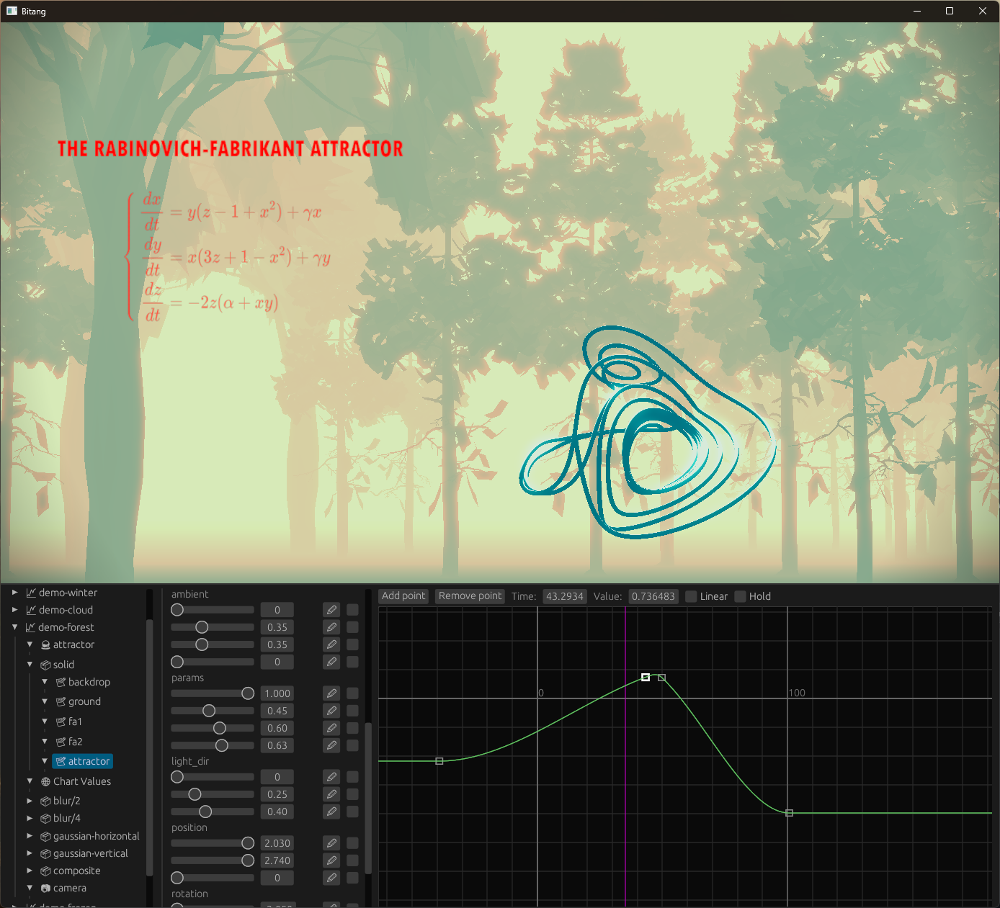

# Bitang

A framework for creative coding, mainly targeted at demoscene productions. Currently in a very early stage of development.

## Features

- Text-based project description of all scenes, use your favorite text editor
- Live reload of all resources including shaders
- Shader variable extraction from GLSL code, just define your uniforms in the shader and they will appear on the UI

Not a lot of docs yet. Use the example project [`"Attractors"`](https://github.com/aedm/bitang/releases/tag/0.1.0) available on the releases page.

## Building

You'll need Rust. 

Just run `cargo build --release` and you'll find the executable in `target/release/bitang`. You might need to install additional resources depending on the platform.

The development platform is Windows, but Linux and MacOS should work as well.

## Hardware requirements

Anything that supports Vulkan.

Known limitations: Radeon RX cards crash in full screen.

## License

MIT

